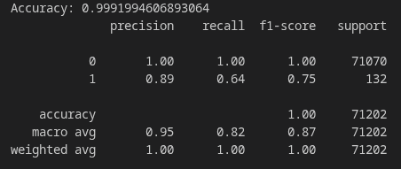
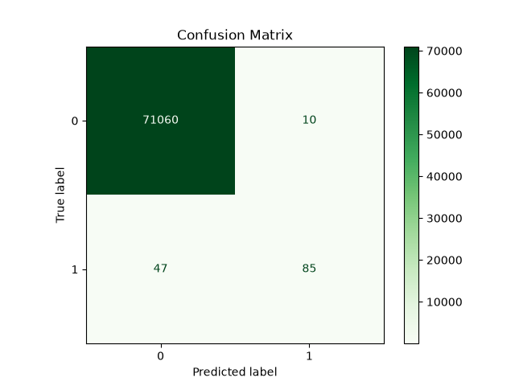
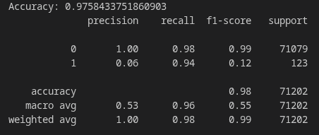
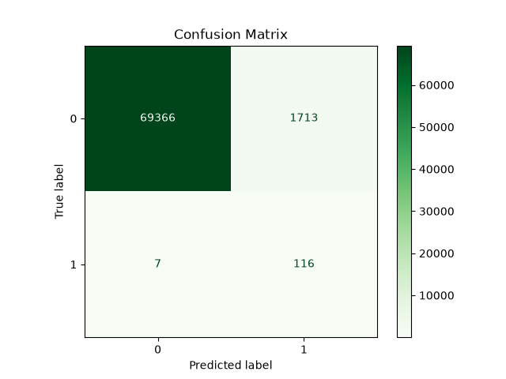

# About the Dataset

The Credit Card Fraud Detection dataset, created by the Machine Learning Group (MLG) and Université Libre de Bruxelles (ULB), is a highly imbalanced dataset containing `28 PCA-transformed features` along with the original `Time` and `Amount` features.

# Solution

To address the class imbalance problem, the following techniques were used:

1. **Stratified Train-Test Split**
   - The `stratify=y` parameter is used in `train_test_split()` to preserve the same class distribution in both the training and testing datasets.

2. **Balanced Class Weights**
   - The `class_weight="balanced"` parameter is used in Logistic Regression. It automatically assigns higher weights to the minority class (fraud) and lower weights to the majority class (non-fraud), allowing the model to pay more attention to fraudulent transactions during training.

# Results

## Without Using Stratification and Balanced Class Weights

  

  

The model achieved an impressive **99.92% accuracy**. However, this accuracy is misleading because the dataset is highly imbalanced. Although most legitimate transactions were classified correctly, **47 fraudulent transactions were incorrectly classified as legitimate**, which could result in significant financial losses.

This issue is clearly reflected in the **Recall** score, which is only **0.64**. In other words, the model detected only **64%** of fraudulent transactions while **36%** were missed.

---

## Using Stratification and Balanced Class Weights

  

  

After applying both techniques, the overall accuracy decreased slightly to **97.58%**, but the model became significantly better at detecting fraud.

The number of missed fraudulent transactions decreased from **47 to just 7**, while the **Recall** improved from **0.64** to **0.94**, meaning the model now detects **94% of all fraudulent transactions**.

The reduction in accuracy is mainly due to an increase in **false positives**, where some legitimate transactions are incorrectly classified as fraudulent. In real-world fraud detection systems, this trade-off is generally acceptable because false positives can be reviewed manually, whereas missed fraudulent transactions can lead to substantial financial losses.
